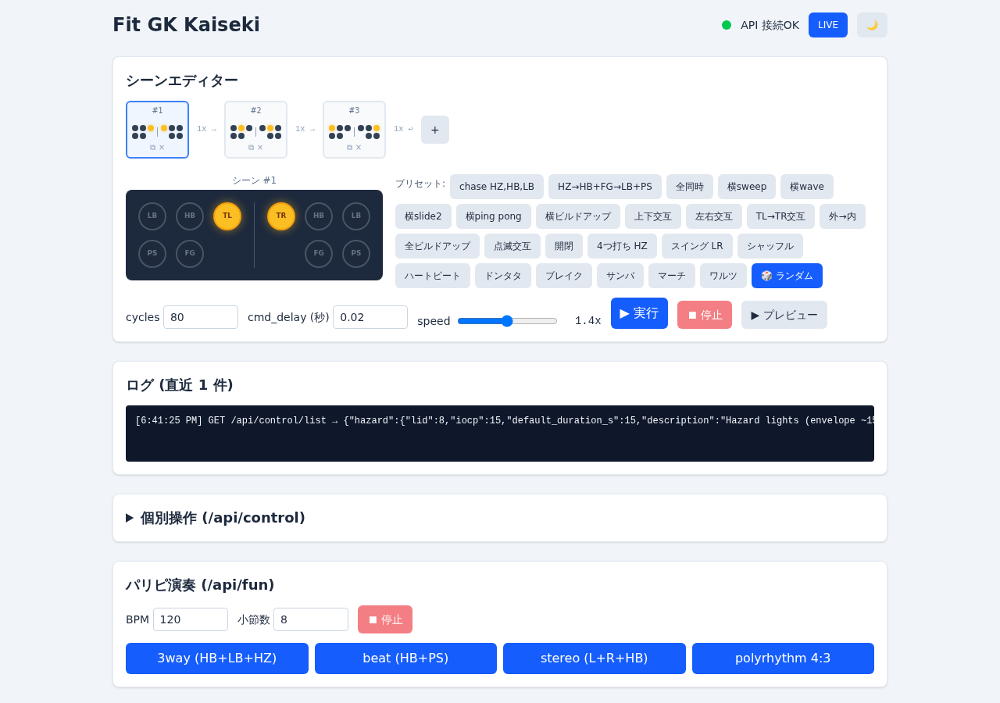
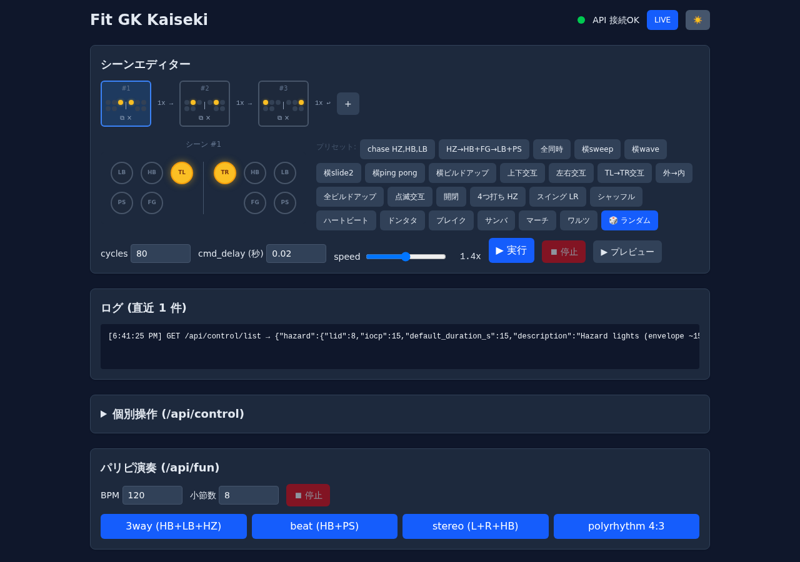
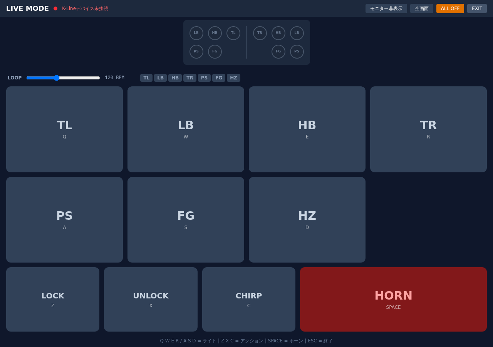

# fit-gk-kaiseki

自分の Honda Fit GK5 RS MT の OBD2 K-Line を解析した記録。 ECM(0x10) の IO Control 経由で MICU 配下のリレー (ハザード/ライト/ロック等) を任意のタイミングで叩けるようになったので、 ついでに FastAPI と Vue で操作 UI まで作った。

自分の車両 + 私的環境での研究目的限定です。 公道で勝手に光らせたりホーンを鳴らしたりはしないでください。 Honda とも当然無関係。

## スクリーンショット

### シーンエディター (通常モード)


### ダークモード


### ライブ演奏モード


## できたこと

ECM(0x10) に対して以下を IO Control で叩けるところまで判明:

| 機能 | LID | IOCP | Envelope |
|---|---|---|---|
| ハザード | 0x08 | 0x0F | ~15s (ドア閉時 MICU即cancel) |
| 左ウィンカー | 0x0A | 0x0F | ~5s |
| 右ウィンカー | 0x0B | 0x0F | ~5s |
| ロービーム | 0x1C | 0x0F | ~15s |
| ハイビーム | 0x1D | 0x0F | ~15s |
| フォグ | 0x20 | 0x0F | ~15s |
| 車幅灯 | 0x25 | 0x0F | ~15s |
| 全ロック | 0x04 | 0x01 | パルス |
| 全解錠 | 0x05 | 0x01 | パルス |
| トランク開放 | 0x09 | 0x01 | パルス |
| ブザー/チャープ | 0x11 | 0x01 | 短 |
| ホーン | 0x26 | 0x01 | ~1s |

加えて StopDiagSession を組み合わせると envelope を任意の長さに切り詰められるので、 本来 15秒固定のハザードを 50ms の超短tap にしたり、 ハイビームを 8Hz で点滅させたり、 ハザード+ハイビーム+ロービームの3系統でビートを打たせたりできる。 詳しくは [docs/findings.md](docs/findings.md)。

## できなかったこと

ワイパー。 NRC=0x10 cluster は session 種別 / Security Access / IOCP / state byte / 別ECUアドレス / 全主要 vehicle state を試したが全部素通り。 純正 HDS が固有の preamble/auth を使ってる雰囲気で、 K-Line 系 aftermarket cable 単独だと届かない。 失敗の足跡は findings.md にまとめてある。

## ハード

- Honda Fit GK5 RS MT (型式 GK5)
- アリエクの FT232RL + L9637D OBD2 USB ケーブル — ELM327 エミュではなく、 純粋な K-Line トランシーバ
- Linux ホスト (Ubuntu/Debian で動作確認)

## 起動

```bash
git clone https://github.com/ritogk/fit-gk-kaiseki.git
cd fit-gk-kaiseki
python3 -m virtualenv .venv
.venv/bin/pip install -r requirements.txt
./run.sh
```

シリアルポートのパーミッションが要る (`/dev/ttyUSB0`):

```bash
sudo chmod 666 /dev/ttyUSB0          # USB抜き差し毎に必要
# または:
sudo usermod -aG dialout $USER && newgrp dialout
```

別ポートなら `KLINE_PORT=/dev/ttyUSB1 ./run.sh`。

ブラウザで `http://127.0.0.1:8000/` 開けば UI、 `/docs` で Swagger。

## 同時点灯の仕組み

K-Line (10400bps, 半二重) はシリアル通信なので物理的に同時送信はできない。 代わりに以下の手順で「同時に見える」点灯を実現している:

```
例: [2,5] (HB + FG 同時点灯)

1. io_control(HB) 送信 → ECMがHBを点灯
2. sleep(cmd_delay)      → 応答がバスから消えるのを待つ
3. reset_input_buffer()  → 応答バイトを読み捨て
4. io_control(FG) 送信 → ECMがFGを点灯 (HBはまだ点いている)
5. sleep(cmd_delay)      → 同上
6. reset_input_buffer()
7. on_s 待機             → 両方点灯中
8. StopDiag 送信         → 全ライト一括消灯
```

ポイント:

- io_control で点けたライトは StopDiag が来るまで消えない (ECMのenvelopeが維持する)
- 応答を `s.read()` でパースせず `sleep` + `reset_input_buffer()` で捨てることで、 read のタイムアウト待ちを省略
- `cmd_delay` (デフォルト 20ms) が1LIDあたりの間隔。 10400bps で コマンド14byte (~13ms) + 応答7byte (~7ms) = ~20ms が物理下限
- 実測では 18ms 前後まで詰められるが、 それ以下だとバス衝突で一部ライトが不発になる

## CLI で叩きたい場合

```bash
.venv/bin/python scripts/fire.py list
.venv/bin/python scripts/fire.py hazard 5
.venv/bin/python scripts/play.py 3way 120 8
.venv/bin/python scripts/play.py pattern 1D 0F 0.1 0.1 12
```

`research/` の中身は解析中に書き散らかしたスクリプトをそのまま残してある。 行き止まりも含めて、 後から再現するときの参考用。

## API

`/api/control/{name}` で個別操作、 `/api/fun/*` でビート系。 操作詳細は Swagger 見るのが早い。

## 構成

```
kline/      K-Line client (ISO 14230 / KWP2000) + ライブセッション
api/        FastAPI ルーター + WebSocket (ライブモード)
web/        Vue 3 + TypeScript + Vite SPA (Tailwind CSS v4)
scripts/    CLI ラッパー
research/   解析中の生スクリプト (失敗込み)
docs/       findings.md + スクリーンショット
```

## ライセンス

MIT。 [LICENSE](LICENSE) 参照。 自分の車で、 自分のリスクで遊んでください。
